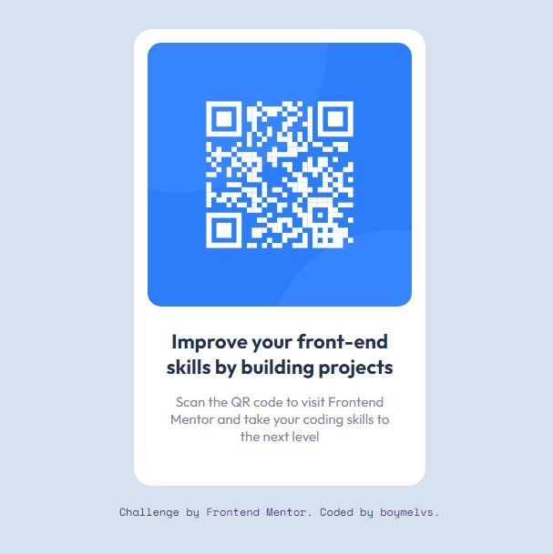

# Frontend Mentor - QR code component solution

## Table of contents

-  [Overview](#overview)
   -  [The challenge](#the-challenge)
   -  [Screenshot](#screenshot)
   -  [Links](#links)
   -  [Built with](#built-with)
-  [Author](#author)

## Welcome! 👋

Thanks for checking out this front-end coding challenge.

## Overview

This is a solution to the [QR code component challenge on Frontend Mentor](https://www.frontendmentor.io/challenges/qr-code-component-iux_sIO_H).

### The challenge

Is to build out QR code component and get it looking as close to the design as possible.

### Screenshot

### Links

-  Live Site URL: [QR code component solution](https://boymelvs.github.io/qr-code-component-main)

### Built with

-  HTML
-  Flexbox
-  CSS

## Author

-  Frontend Mentor - [Melvin](https://www.frontendmentor.io/profile/boymelvs)
